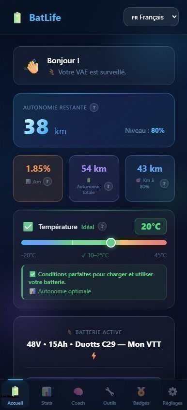
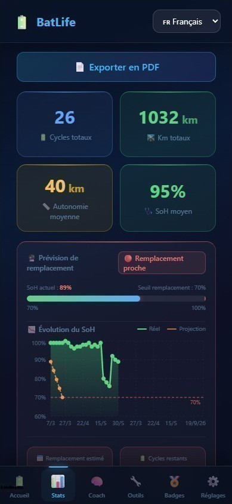
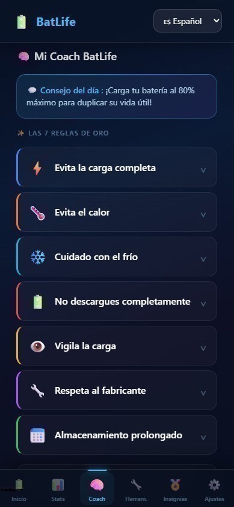
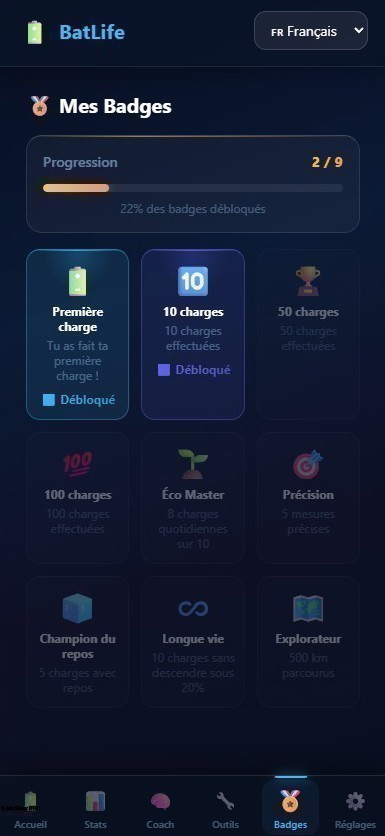

<div align="center">

# 🔋 BatLife

### L'app qui vous aide à prolonger la vie de votre batterie e-bike & trottinette

[](https://batlife.app)
[](https://batlife.app)
[](#-langues-supportées)
[](LICENSE)

**Suivez, comprenez et préservez la santé de votre batterie Li-ion**  
*Gratuit • Sans pub • Sans tracking • 100% local*

[🚀 Essayer maintenant](https://batlife.app) • [📖 Fonctionnalités](#-fonctionnalités) • [☕ Soutenir le projet](https://buymeacoffee.com/batlife)

</div>

---

## 📸 Aperçu

<div align="center">

<table>
  <tr>
    <td align="center"><b>🏠 Dashboard</b></td>
    <td align="center"><b>📊 Statistiques</b></td>
  </tr>
  <tr>
    <td></td>
    <td></td>
  </tr>
  <tr>
    <td align="center"><b>🧠 Coach</b></td>
    <td align="center"><b>🏅 Badges</b></td>
  </tr>
  <tr>
    <td></td>
    <td></td>
  </tr>
</table>

</div>

---

## 💡 Pourquoi BatLife ?

Une batterie Li-ion mal utilisée peut perdre **jusqu'à 50% de sa capacité en 2 ans**.  
BatLife est né d'un simple fichier Excel créé par un passionné pour suivre ses trajets et sa batterie.  
Aujourd'hui, c'est une **PWA moderne** qui vous aide à :

- 📈 **Comprendre** votre consommation réelle (Wh/km)
- 🔋 **Optimiser** vos habitudes de charge
- ⏳ **Préserver** la durée de vie de votre batterie
- 🌍 **Économiser** de l'énergie et de l'argent

---

## ✨ Fonctionnalités

### 🎯 Cœur de l'app
- 🔋 **Suivi de charge intelligent** avec repos de stabilisation
- 📊 **Autonomie réelle** calculée sur vos vrais trajets
- ⚡ **Consommation Wh/km** précise (pas celle du constructeur)
- 🌡️ **Conseils dynamiques selon la température** (gel, chaud, idéal...)
- 📈 **État de santé (SoH)** et prévision de remplacement

### 🧠 Intelligence
- 💬 **Coach intégré** avec les 7 règles d'or
- 🔔 **Rappels intelligents** (charge d'équilibrage mensuelle, absence de charge)
- 🏅 **Système de badges** pour progresser
- 📋 **Journal d'entretien** (pneus, chaîne, freins...)

### 🛠️ Outils
- 📏 **Calibration voltmètre → capacité**
- ❄️ **Diagnostic hivernage** personnalisé
- 💾 **Export/Import JSON** (sauvegarde complète)
- 🔄 **Migration depuis les anciennes versions**

### 🔒 Éthique & vie privée
- ✅ **Aucune donnée collectée** — tout reste sur votre appareil
- ✅ **Aucune publicité**, aucun tracker
- ✅ **Code open source**
- ✅ **Fonctionne hors-ligne** (PWA)

---

## 🌍 Langues supportées

| 🇫🇷 Français | 🇬🇧 English | 🇪🇸 Español | 🇩🇪 Deutsch | 🇳🇱 Nederlands |
|:-:|:-:|:-:|:-:|:-:|
| ✅ | ✅ | ✅ | ✅ | ✅ |

---

## 🚀 Installation

### 📱 Installer sur votre téléphone (recommandé)

BatLife est une **Progressive Web App (PWA)** — pas besoin du Play Store ou App Store !

1. Ouvrez [**batlife.app**](https://batlife.app) sur votre téléphone
2. Menu navigateur → **"Ajouter à l'écran d'accueil"**
3. C'est prêt ! L'app fonctionne comme une vraie application ✨

### 💻 Utilisation sur ordinateur

Ouvrez simplement [**batlife.app**](https://batlife.app) dans votre navigateur.

---

## 🛠️ Stack technique

- ⚛️ **React 18** + Vite
- 🎨 **Tailwind CSS** avec design glassmorphism
- 📊 **Recharts** pour les graphiques
- 💾 **LocalStorage** pour la persistance (zéro serveur)
- 🌐 **PWA** avec Service Worker
- ☁️ Hébergé sur **Cloudflare Pages**

---

## 🏗️ Développement local

```bash
git clone https://github.com/contactbatlife-debug/batlife.git
cd batlife
npm install
npm run dev
```

---

## 🤝 Contribuer

BatLife est un projet indépendant maintenu bénévolement.  
Toute contribution est la bienvenue :

- 🐛 [Signaler un bug](https://github.com/contactbatlife-debug/batlife/issues)
- 💡 [Proposer une fonctionnalité](https://github.com/contactbatlife-debug/batlife/issues)
- 🌍 Aider à traduire dans d'autres langues
- ⭐ **Mettre une étoile** au projet !

---

## ☕ Soutenir le projet

BatLife est **100% gratuit et sans pub**.  
Créé par un retraité passionné, ce projet est né d'un simple fichier Excel.  
Si l'app vous est utile, vous pouvez soutenir son développement :

<a href="https://buymeacoffee.com/batlife">
  
</a>

---

## 📜 Licence

Ce projet est sous licence **MIT** — libre d'utilisation, de modification et de partage.

---

## ⚠️ Avertissement

BatLife est un **outil indicatif**. Il ne remplace pas les instructions du fabricant de votre batterie ou du BMS.  
Les estimations sont basées sur vos données et des calculs statistiques — utilisez votre jugement.

---

<div align="center">

**Fait avec 💙 par un passionné de mobilité électrique**

[🌐 batlife.app](https://batlife.app) • [☕ Buy me a coffee](https://buymeacoffee.com/batlife)

</div>